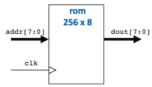
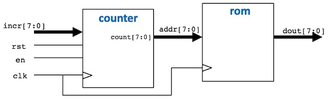

<center>

## EIE2 Instruction Set Architecture & Compiler (IAC)

---
## Lab 2 - Signal Generation and Capture

**_Peter Cheung, V1.0 - 26 Oct 2022_**

---

</center>

## Objectives
By the end of this experiment, you should be able to:
* write a basic System Verilog specification for a memory component
* pre-load the memory with known contents stored in an initialization file
* design a signal generator by combining a counter with a ROM component
* change the frequency of the signal with rotary encoder on Vbuddy
* generate two sinusoidal signals simultaneously with different phases using dual-port ROM
* capture and store a audio signal using the microphone on Vbuddy and a RAM component
* read and write to a RAM component simultaneously
* use parameterisation to generalise designs for different address or data widths

Clone to your local disk this repo.

---
## Task 1 - Simple sinewave generator
---

**Step 1 - Specifying a 256 x 8 bit ROM**

Open in VS Code the folder for this repo. In the folder **_task1_**,   create the component **__rom.sv__** according to Lecture 4 slide 14.

<p align="center">  </p>

Examine the files **_sinegen.py_** and **_sinerom.mem_**. Make sure you understand how these are used to initialise the ROM.

**Step 2 - Create the sinegen module**

This requires you to create a "top-level" module **_sinegen.sv_**, which includes two components: **_counter.sv_** and **_rom.sv_** as shown below. (See L2 slide 16).

<p align="center">  </p>

**Step 3 - Create the testbench for sinegen**

Based on what you learned from Lab 1, try to write the testbench **_sinegen_tb.cpp_** on your own. You should initially set incr[7:0] to 1.  Then use the **_vbdPlot()_** function to plot output data sample to Vbuddy. If you need help, I have included my version of **_sinegen_tb.cpp_** at the end of this file as an appendix.

Here are two things you should do:
1. Since you are generating a continuous sinewave, the number of simulation cycle should be increased to a large value, say, 1,000,000!
2. Because of this large number of simulation cycles before termination, you need to have an elegant way to exit the simulation.  Use the **_vbdGetkey()_** function to check if a key has been pressed.  This can be achieved with the following code snippet to exit the simulation any time you press the 'q' key:
   
```C++
    // either simulation finished, or 'q' is pressed
    if ((Verilated::gotFinish()) || (vbdGetkey()=='q')) 
      exit(0);                // ... exit if finish OR 'q' pressed
```
Note that **_vbdGetkey()_** is non-blocking, meaning that it returns immediately with a NULL character if no key is pressed, otherwise it returns the ASCII code of the key being pressed.

**Step 4 - Modify the shell script _doit.sh_**
You should know how to do this by now.

Now, make the Verilated model and test your signal generator.

---
### _Test-yourself Challenge_

Modify your design so that you use the **_vbdValue()_** function to chage the frequency of the sinewave generated.

---
## Task 2 - Sine and Cosine Dual wave generation 
---

Copy over to the task2 folder the main files from Task 1. Modify your design in Task 1 so that you generate **TWO** simultaenous sinusoid signals which have different phases.  The phase offset between the two sinusoids is determined by the rotary encoder on Vbuddy.  You need to use a dual-port ROM similar to that you used in Task 1. The first port's address **_addr1[7:0]_** is from the counter. The second port's address **_addr2]7:0]_** is offset from the first address.  This offset is read from Vbuddy with the **_vbdValue()_** function.

To display two waveforms on Vbuddy, you can call the **_vbdPlot()_** function twice, first with **_data1[7:0]_**, then with **_data2[7:0]_**.  

Test your design.

By setting the offset value to 64, the two waveforms will be exactly 90 degrees apart in their phases, making one a sinewave and the other a cosine wave at the same frequency.  These signals, called "quadrature signals", are often used in communication systems.

---
## Task 3 - Capture and display audio signal in RAM
---

The goal of Task 3 is to capture real audio signal using the microphone/amplifier module on Vbuddy.  These samples are written to a dual-port RAM stored in successive locations.  At the same time, read back from  the RAM the store signal at a different address offset from the write address.  In this way, the retrieved signal is a delayed version of the original signal.

The difference between the read and write addresses is the offset.  Use the **_vbdValue()_** function to vary this offset using the rotary encoder.

You can plot both the write and read data on the Vbuddy display (using **_vbdPlot()_** function). 

Capturing audio signal from Vbuddy requires two steps:
1. Use the **_vbdInitMicIn()_** function to inform Vbuddy the size of audio signal buffer to reserve for storing the captured sample.
2. Use the **_vbdMicValue()_** function to return the next sample in the audio buffer. When all the samples are exhausted, Vbuddy will automatically capture another block of audio samples and store them in the audio buffer.

```C++
  // intialize variables for analogue output
  vbdInitMicIn(RAM_SZ);
  
  // ask Vbuddy to return the next audio sample
  top->mic_signal = vbdMicValue();
```

To perform this task you need to first create a 512 x 8 bit dual-port RAM component. (See notes.)  Combine the dual-port RAM with the counter to form a top-level module (say, **_sigdelay.sv_**).  To save time, the testbench **_sigdelay_tb.cpp_** is provide for you in the Lab_2 repo.

Compile and test your design.  You need an audio signal source. I suggest that you can use the following online website to generate a variety of signals at different frequencies:

[Tone Generator](https://onlinetonegenerator.com)
<center>

---
## CONGRATULATIONS! You have completed Lab 2.
---
</center>

<center>

## Appendix 1 - Testbench for task 1

</center>

```C++
#include "verilated.h"
#include "verilated_vcd_c.h"
#include "Vsinegen.h"

#include "vbuddy.cpp"     // include vbuddy code
#define MAX_SIM_CYC 1000000
#define ADDRESS_WIDTH 8
#define ROM_SZ 256

int main(int argc, char **argv, char **env) {
  int simcyc;     // simulation clock count
  int tick;       // each clk cycle has two ticks for two edges

  Verilated::commandArgs(argc, argv);
  // init top verilog instance
  Vsinegen* top = new Vsinegen;
  // init trace dump
  Verilated::traceEverOn(true);
  VerilatedVcdC* tfp = new VerilatedVcdC;
  top->trace (tfp, 99);
  tfp->open ("sinegen.vcd");
 
  // init Vbuddy
  if (vbdOpen()!=1) return(-1);
  vbdHeader("L2T1: SigGen");
  //vbdSetMode(1);        // Flag mode set to one-shot

  // initialize simulation inputs
  top->clk = 1;
  top->rst = 0;
  top->en = 1;
  top->incr = 1;

  // run simulation for MAX_SIM_CYC clock cycles
  for (simcyc=0; simcyc<MAX_SIM_CYC; simcyc++) {
    // dump variables into VCD file and toggle clock
    for (tick=0; tick<2; tick++) {
      tfp->dump (2*simcyc+tick);
      top->clk = !top->clk;
      top->eval ();
    }
    
    top->incr = vbdValue();
    // plot ROM output and print cycle count
    vbdPlot(int (top->dout), 0, 255);
    vbdCycle(simcyc);

    // either simulation finished, or 'q' is pressed
    if ((Verilated::gotFinish()) || (vbdGetkey()=='q')) 
      exit(0);                // ... exit if finish OR 'q' pressed
  }

  vbdClose();     // ++++
  tfp->close(); 
  exit(0);
}
```
